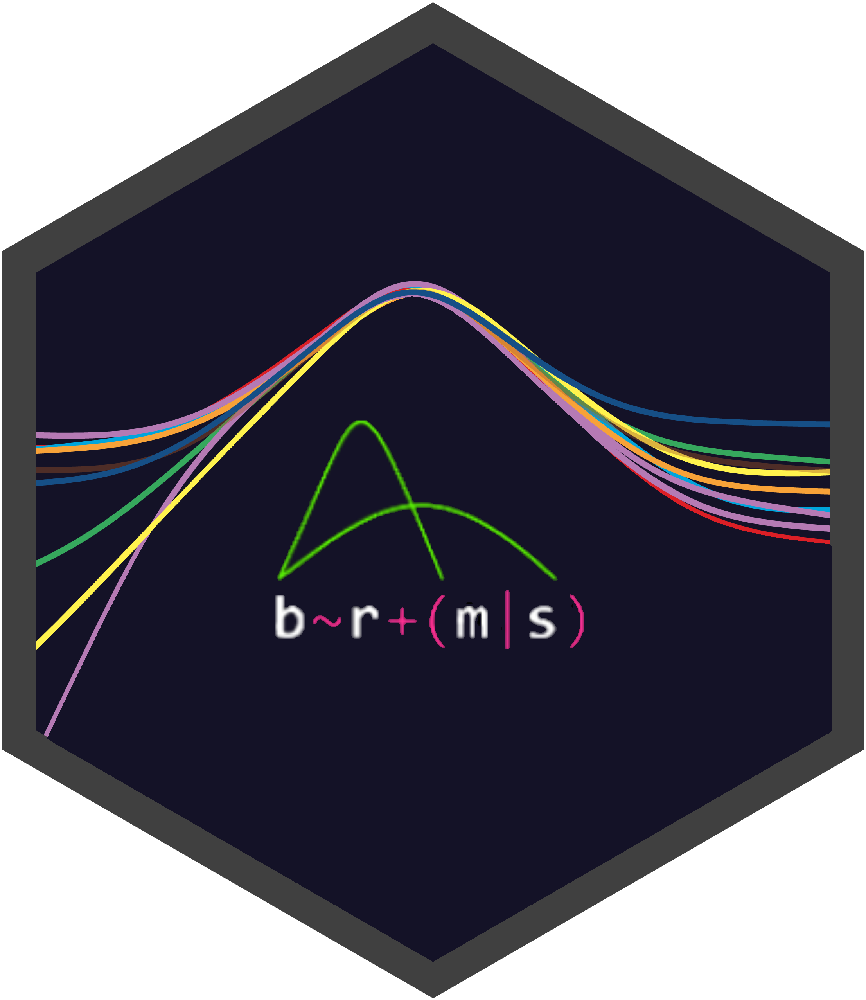

<!-- README.md is generated from README.Rmd. Please edit that file -->

Bindings for Bayesian TidyModels 
===========================================================================================================================================================

<!-- badges: start -->

<!-- badges: end -->

[**`bayesian`**](https://hsbadr.github.io/bayesian/) supports Bayesian
modeling using
[`brms`](https://paul-buerkner.github.io/brms/)/[`Stan`](https://mc-stan.org/)
with
[`parsnip`](https://parsnip.tidymodels.org/)/[`tidymodels`](https://www.tidymodels.org/).

Installation
------------

The stable version of [`bayesian`](https://hsbadr.github.io/bayesian/)
can be installed from
[CRAN](https://CRAN.R-project.org/package=bayesian) using:

    install.packages("bayesian")

The development version of
[`bayesian`](https://hsbadr.github.io/bayesian/) can be installed from
[GitHub](https://github.com/hsbadr/bayesian) using:

    install.packages("pak", repos = "https://r-lib.github.io/p/pak/dev/")
    pak::pkg_install("hsbadr/bayesian")

Example
-------

    library(bayesian)

    bayesian_mod <-
      bayesian() %>%
      set_engine("brms") %>%
      fit(
        rating ~ treat + period + carry + (1 | subject),
        data = inhaler
      )

    summary(bayesian_mod$fit)

For more details, [get started with
`bayesian`](https://hsbadr.github.io/bayesian/articles/GetStarted.html).

Citation
--------

To cite `bayesian` in publications, please use:

    citation("bayesian")

> Hamada S. Badr and Paul C. Bürkner (2021): bayesian: Bindings for
> Bayesian TidyModels, [*Comprehensive R Archive Network
> (CRAN)*](https://cran.r-project.org/package=bayesian). URL:
> <https://hsbadr.github.io/bayesian/>.

Contributing
------------

This project is released with a [Contributor Code of
Conduct](https://contributor-covenant.org/version/2/0/CODE_OF_CONDUCT.html).
By contributing to this project, you agree to abide by its terms.

-   For questions and discussions about tidymodels packages, modeling,
    and machine learning, please [post on RStudio
    Community](https://community.rstudio.com/).

-   If you think you have encountered a bug, please [submit an
    issue](https://github.com/hsbadr/bayesian/issues).

-   Either way, learn how to create and share a
    [reprex](https://reprex.tidyverse.org) (a minimal, reproducible
    example), to clearly communicate about your code.

-   Check out further details on [contributing guidelines for tidymodels
    packages](https://www.tidymodels.org/contribute/) and [how to get
    help](https://www.tidymodels.org/help/).
